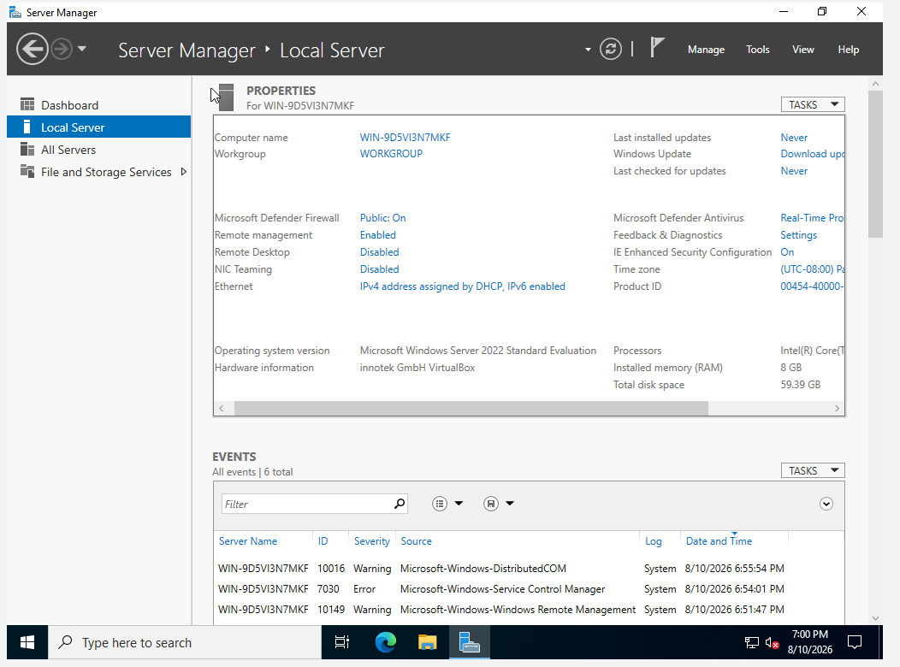
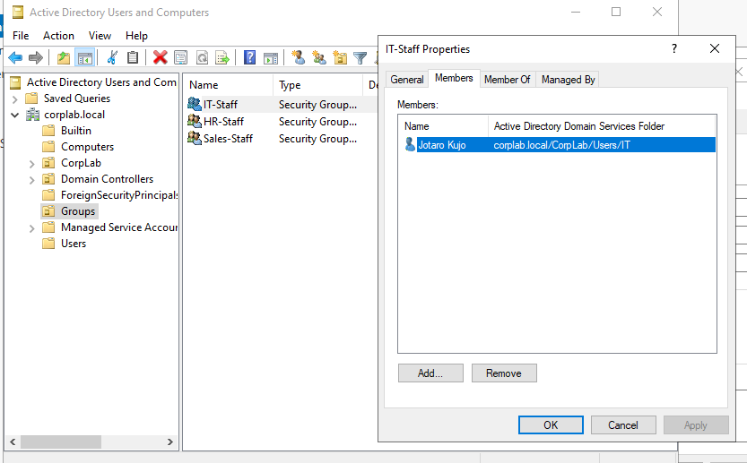

# Active Directory Home Lab

## Project Overview

I built a virtual Windows domain environment to practice common entry-level IT support and Active Directory administration tasks. The lab includes a Windows Server domain controller and a domain-joined Windows client.

The project is to shows user and computer administration, organizational units, Group Policy, password resets, account lockout troubleshooting, security groups, and shared-folder permissions.

## Lab Environment

* VirutalMachine
* Window 11 Pro
* Window Server 2022
* **Domain:** `corplab.local`
* **Domain Controller:** `DC01`
* **Client Computer:** `PC01`
* **Test User:** `CORPLAB\jotaro.kujo`
* **Security Group:** `GG_IT_Share_RW`
* **Network Share:** `\\DC01\IT-Share`

## Skills Demonstrated

* Installed and configured Active Directory Domain Services
* Created a new Windows domain
* Organized users and computers with organizational units
* Joined a Windows client to the domain
* Created and managed domain users
* Reset user passwords
* Configured an account-lockout policy using Group Policy
* Diagnosed and unlocked a locked domain account
* Created and managed an Active Directory security group
* Configured share and NTFS permissions
* Tested authorized access, denied access, and restored access
* Used PowerShell to verify domain and account status

## Project Walkthrough

### 1. Windows Server and Domain Setup

I installed Windows Server on `DC01`, added the Active Directory Domain Services role, and change the server to a domain controller. I then created the new forest and domain named `corplab.local`.

This domain controller become a centralized authentication and administration for the lab environment.

### 2. Active Directory Structure and User Management

After creating the `corplab.local` domain, I used Active Directory Users and Computers to organize domain resources. I created organizational units for users and groups instead of leaving every object in the default containers. For a more organized look.

The test user **Jotaro Kujo** was placed in the `CorpLab\Users\IT` organizational unit structure. This makes user accounts easier to manage and prepares the environment for applying permissions and policies based on department or job role.

I also assigned Jotaro to the `IT-Staff` security group to demonstrate group-based user organization and management.

